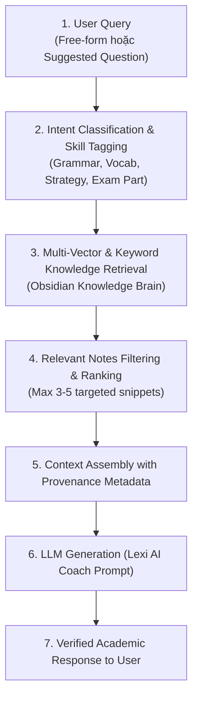

# 🔍 Retrieval Policy — Quy Tắc Truy Xuất Tri Thức Cho AI Tutor

Quy chuẩn này xác định luồng xử lý và truy xuất thông tin từ Obsidian Knowledge Brain sang AI Tutor.

---

## 1. Luồng Xử Lý Truy Xuất (Knowledge Retrieval Flow)

---

## 2. Xử Lý Câu Hỏi Tự Do (Free-Form Questions Support)
- **Không bao giờ từ chối câu hỏi tự do:** Bất kể người dùng gõ câu hỏi ngắn, câu hỏi dài, câu hỏi bằng tiếng Việt hay tiếng Anh, hệ thống đều phân tích semantic để tìm note phù hợp nhất.
- **Fall-back thông minh:** Nếu câu hỏi không khớp trực tiếp với ghi chú Edulife nào, hệ thống sử dụng tri thức tiếng Anh tổng quát chuẩn CEFR B2 và nêu rõ ngữ cảnh.
- **Truy xuất theo Tags & Properties:**
  - `skill`: `grammar`, `vocabulary`, `reading`, `listening`, `writing`, `speaking`
  - `level`: `B1`, `B2`, `General`
  - `type`: `teaching-material`, `strategy`, `common-errors`
