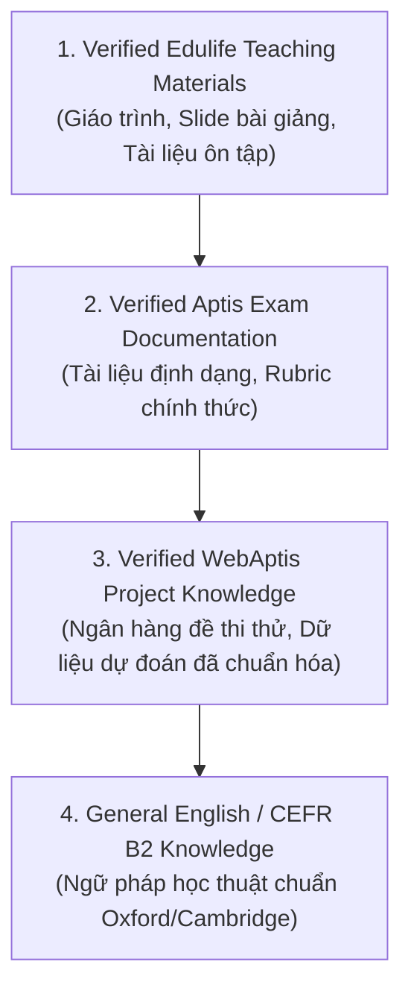

# 📚 Source Policy — Chính Sách Nguồn Tri Thức

Knowledge Brain thiết lập thứ tự ưu tiên và phân loại nguồn tài liệu rõ ràng nhằm đảm bảo độ tin cậy học thuật cao nhất.

---

## 1. Thứ Tự Ưu Tiên Nguồn (Source Hierarchy)

---

## 2. Phân Loại Nguồn (Source Types)

| Source Type | Mô tả | Ứng dụng trong AI Brain |
| :--- | :--- | :--- |
| `teaching-material` | Sách giáo trình, bài giảng lý thuyết từ Edulife | Cung cấp định nghĩa, công thức, bài tập mẫu và giải thích chi tiết |
| `exam-content` | Bộ đề thi thử 5 kỹ năng | Tham chiếu cấu trúc câu hỏi, dạng bài thực tế |
| `prediction-content` | Ngân hàng đề Writing & Speaking dự đoán | Cung cấp ngữ cảnh chủ đề phong phú và từ vựng mở rộng |
| `strategy` | Mẹo làm bài, kỹ thuật phân bổ thời gian, tránh bẫy | Hướng dẫn học viên tối ưu hóa điểm số |
| `user-memory` | Ghi chú cá nhân hóa, điểm yếu cần khắc phục | Cá nhân hóa lộ trình ôn luyện của học viên |
| `qa-audit` | Báo cáo kiểm định, lịch sử sửa lỗi và provenance | Đảm bảo tính toàn vẹn và độ tin cậy của hệ thống tri thức |
