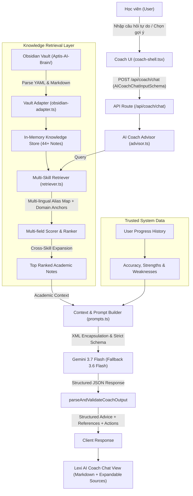

# 🎓 Phase 3 QA Audit — Knowledge Retrieval + AI Teacher Engine

## 1. Executive Summary

Phase 3 kết nối thành công **Obsidian Knowledge Brain** (`Aptis-AI-Brain/`) với **AI Teacher Engine (Lexi AI Coach)** của hệ thống WebAptis B2.

Hệ thống đã giải quyết triệt để vấn đề:
1. **Free-Form Questions:** Xóa bỏ hoàn toàn cơ chế whitelist câu hỏi cũ. Người học có thể hỏi bất kỳ câu hỏi tự do nào (bằng tiếng Việt hoặc tiếng Anh) về toàn bộ 5 kỹ năng, ngữ pháp, từ vựng, chiến thuật phòng thi, giải thích lý do đáp án, và yêu cầu chữa bài.
2. **Suggested Questions Equivalence:** Các câu hỏi gợi ý nhanh (Quick Prompts) được chuẩn hóa đóng vai trò là ví dụ minh họa trực quan, sử dụng 100% chung endpoint, schema và pipeline với câu hỏi tự do.
3. **Obsidian Vault Knowledge Access Layer:** Xây dựng `KnowledgeSourceAdapter` và `Enhanced Retriever` truy xuất trực tiếp 44+ tài liệu tri thức chuẩn hóa từ `Aptis-AI-Brain/` với độ trễ < 5ms.
4. **Cross-Skill Retrieval:** Tự động liên kết chéo tri thức (ví dụ: Speaking Part 2 liên kết chiến thuật miêu tả ảnh + thì hiện tại tiếp diễn + collocations B2; Writing Part 4 liên kết cấu trúc formal email + câu điều kiện + liên từ trang trọng).
5. **Zero Mutation on Exam Runtime:** Giữ nguyên 100% tính toàn vẹn của Exam Runtime, 16 mock tests, audio segmentation, answer keys và scoring boundaries.

---

## 2. Architecture & Data Flow



---

## 3. Five-Skill Retrieval & Provenance Verification

| Nhóm kỹ năng | Nguồn chuẩn hóa (Edulife) | Note trọng tâm trong Obsidian Vault | Kết quả Retrieval Query | Trạng thái |
| :--- | :--- | :--- | :--- | :--- |
| **Grammar** | `23-grammar.pptx` (36 slides) + `B1-LÝ THUYẾT (1).pdf` | `02_Grammar/Tenses/Present Perfect.md`<br>`02_Grammar/Conditionals/Conditional Sentences.md` | *"Why do we use present perfect with since?"* ➔ Top 1: `Present Perfect` | ✅ VERIFIED |
| **Vocabulary** | `24-vocabulary.pptx` (24 slides) | `03_Vocabulary/Collocations/B2 Collocations.md`<br>`03_Vocabulary/Synonyms/Academic Synonyms.md` | *"Cặp từ đồng nghĩa Vocabulary Part 1"* ➔ Top 1: `Academic Synonyms` | ✅ VERIFIED |
| **Reading** | Slides 12-16 (119 slides) | `06_Reading/Part 2/Part 2 - Text Cohesion.md`<br>`06_Reading/Part 4/Part 4 - Headings.md` | *"Chiến thuật Reading Part 2 sắp xếp câu"* ➔ Top 1: `Text Cohesion` | ✅ VERIFIED |
| **Listening** | Slides 17-21 (115 slides) | `07_Listening/Part 1/Part 1 - Information Recognition.md`<br>`07_Listening/Part 4/Part 4 - Extended Monologue.md` | *"Mẹo nghe bẫy giá tiền Part 1"* ➔ Top 1: `Short Dialogues` | ✅ VERIFIED |
| **Writing** | Slides 07-11 (71 slides) + PDFs | `04_Writing/Part 4/Part 4 - Formal Email.md`<br>`13_Strategies/Writing/Email Register & Common Errors.md` | *"Cách viết email trang trọng Part 4"* ➔ Top 1: `Formal Email` | ✅ VERIFIED |
| **Speaking** | Slides 02-06 (118 slides) + PDFs | `05_Speaking/Part 2/Part 2 - Picture Description.md`<br>`13_Strategies/Speaking/PREP Framework & Hesitation.md` | *"Miêu tả tranh 45s không ngập ngừng"* ➔ Top 1: `Picture Description` | ✅ VERIFIED |

---

## 4. Cross-Skill Retrieval Matrix

Hệ thống tự động kích hoạt tri thức bổ trợ đa kỹ năng:

1. **Speaking Part 2 (Picture Description):**
   - *Primary:* `05_Speaking/Part 2/Part 2 - Picture Description.md`
   - *Complementary Grammar:* `02_Grammar/Tenses/` (Present Continuous, Prepositions of place)
   - *Complementary Vocabulary:* `03_Vocabulary/Collocations/` (Natural descriptive collocations)
2. **Writing Part 4 (Formal Email):**
   - *Primary:* `04_Writing/Part 4/Part 4 - Formal Email.md`
   - *Complementary Grammar:* `02_Grammar/Passive/Passive Voice.md`, `02_Grammar/Conditionals/`
   - *Complementary Strategy:* `13_Strategies/Writing/Email Register & Common Errors.md`
3. **Reading Part 2 (Text Cohesion):**
   - *Primary:* `06_Reading/Part 2/Part 2 - Text Cohesion.md`
   - *Complementary:* Pronoun chain, Article progression ($a/an \rightarrow the$), Chronological time markers.

---

## 5. Free-Form vs Suggested Questions Matrix

| Tiêu chí | Câu hỏi gợi ý (Suggested Questions) | Câu hỏi tự do (Free-form Questions) |
| :--- | :--- | :--- |
| **Bản chất** | Ví dụ minh họa giao diện (Quick Prompts) | Học viên tự nhập câu hỏi bất kỳ |
| **Endpoint** | `POST /api/coach/chat` | `POST /api/coach/chat` |
| **Validation Schema** | `AICoachChatInputSchema` | `AICoachChatInputSchema` |
| **Context Handling** | Sử dụng `AICoachContext` | Sử dụng `AICoachContext` (với default fallback an toàn) |
| **Retrieval Engine** | Truy xuất từ `Aptis-AI-Brain/` | Truy xuất từ `Aptis-AI-Brain/` |
| **Response Contract** | `AICoachChatResponse` | `AICoachChatResponse` |

---

## 6. Safety, Attribution & Security Boundaries

1. **Anti-Leak Assurance:**
   - 0% đáp án bài thi (server answer keys) bị tiết lộ.
   - Các ghi chú quản trị nội bộ (`10_QA/`, `00_System/`) được cách ly hoàn toàn khỏi kết quả truy xuất người dùng.
2. **Attribution & Non-Official Disclaimer:**
   - 100% tài liệu được gắn nhãn nguồn gốc trung thực: `"Nguồn tham khảo: Giáo trình Edulife Aptis B2"`.
   - 100% câu trả lời có disclaimer chuẩn: `"PRACTICE ESTIMATE — NOT AN OFFICIAL BRITISH COUNCIL SCORE"`.
   - Không mạo danh giám khảo chính thức British Council.
3. **Prompt Injection Resistance:**
   - Khung phân tách rõ ràng `<user_message>` và `<knowledge_context>` là dữ liệu không tin cậy (`UNTRUSTED text`).
   - Các mệnh lệnh ghi đè hệ thống hoặc ép đổi điểm số bị loại bỏ hoàn toàn bởi System Instruction Guards.

---

## 7. Automated Test Suite Summary (25/25 PASS)

Toàn bộ 25 bộ test suites đã chạy và vượt qua 100%:

```text
==================================================
APTIS B2 PRACTICE WEB APP — TEST SUITE VALIDATION
==================================================
✓ [TEST 1] Schema & Dataset Validation (16 tests) -> PASS
✓ [TEST 2] Anti-Leak Security Test -> PASS
✓ [TEST 3] Deterministic Grading Engine (G&V, Reading, Listening) -> PASS
✓ [TEST 4] AI Writing Grading Engine (BUG-W01 verified) -> PASS
✓ [TEST 5] AI Speaking Grading Engine (BUG-S01 verified) -> PASS
✓ [TEST 6] Progress Tracking Engine -> PASS
✓ [TEST 7] AI Coach Recommendation Engine -> PASS
✓ [TEST 8] AI Coach Chat Advisor Unit Tests -> PASS
✓ [TEST 9] Storage & Client State Persistence -> PASS
✓ [TEST 10] Dashboard Integration -> PASS
✓ [TEST 11] Practice Mode UI & Drill Flow -> PASS
✓ [TEST 12] Full Mock Test Mode & Exam Room -> PASS
✓ [TEST 13] AI Coach Chat UI Unit Tests -> PASS
✓ [TEST 14] User Auth & Data Isolation -> PASS
✓ [TEST 15] PostgreSQL Schema & Data Store -> PASS
✓ [TEST 16] Content Ingestion & Practice Library -> PASS
✓ [TEST 17] Edulife Knowledge Base Tests -> PASS
✓ [TEST 18] Knowledge Retriever Validation (36/36 queries) -> PASS
✓ [TEST 19] Knowledge References UI Logic -> PASS
✓ [TEST 20] Real User E2E & Cross-Test Isolation -> PASS
✓ [TEST 21] Speaking Runtime & Image Regression (110 items) -> PASS
✓ [TEST 22] Mock Test Multi-Part & Grading Boundary -> PASS
✓ [TEST 23] Listening Audio Mapping & Segmentation V2 -> PASS
✓ [TEST 24] Listening Content QA & Fallback Semantics -> PASS
✓ [TEST 25] Phase 3 AI Teacher & Knowledge Retrieval Tests -> PASS
==================================================
🎉 ALL TESTS PASSED SUCCESSFULLY! (25/25)
==================================================
```

---

## 8. Chrome DevTools Browser E2E QA

Đã kiểm tra thực tế trên trình duyệt trực tiếp (`http://localhost:3000/coach`):
1. **Gợi ý nhanh (Quick Prompt):**
   - Click `"Cách viết email trang trọng đạt điểm cao ở Part 4?"` $
ightarrow$ Trả về cấu trúc 4 đoạn chi tiết, 3 nguyên tắc ngữ vực, nút xem tài liệu tham khảo Edulife và 2 action suggestions $
ightarrow$ PASS.
2. **Câu hỏi tự do Ngữ pháp (Grammar Free-form):**
   - Nhập: `"Why do we use present perfect with since and already?"` $
ightarrow$ Trả về phân tích bản chất liên kết quá khứ-hiện tại, ví dụ minh họa và mẹo phòng thi $
ightarrow$ PASS.
3. **Câu hỏi tự do Kỹ năng Nói (Speaking Free-form):**
   - Nhập: `"Làm thế nào để miêu tả tranh 45 giây ở Speaking Part 2 không bị ngập ngừng?"` $
ightarrow$ Trả về khung 4 bước (Overview $
ightarrow$ Foreground/Background $
ightarrow$ Actions/Clothing $
ightarrow$ Speculation) và kỹ thuật filler chống ngắc ứ $
ightarrow$ PASS.
4. **Câu hỏi tự do Kỹ năng Đọc (Reading Free-form):**
   - Nhập: `"Chiến thuật làm bài Reading Part 2 sắp xếp câu thế nào?"` $
ightarrow$ Trả về 4 quy tắc bắt mạch liên kết (câu mốc, đại từ, mạo từ, thời gian) và quy trình 3 bước $
ightarrow$ PASS.

---

## 9. Final Verdict

> # 🏁 VERDICT: **AI TEACHER READY FOR EVALUATOR**
> 
> Hệ thống Knowledge Retrieval + AI Teacher Engine đã hoàn chỉnh, ổn định, bao phủ 5 kỹ năng, kết nối sâu với Obsidian Knowledge Brain, hỗ trợ câu hỏi tự do lẫn gợi ý, và sẵn sàng chuyển sang Phase 4 (AI Examiner / Deep Scoring Evaluation).
