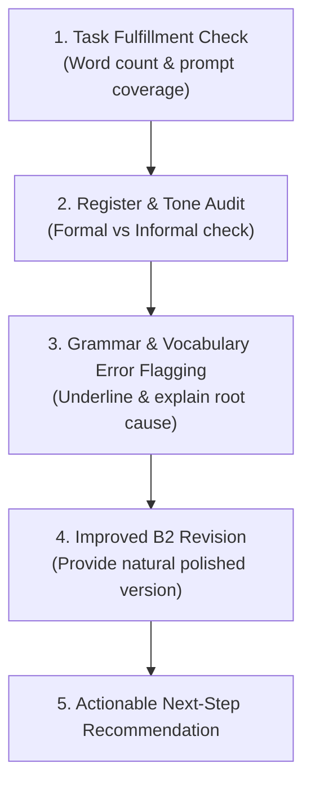

# Quy Trình Chẩn Đoán & Chữa Bài Writing Từng Bước (AI Feedback Framework)

Khi AI Tutor (Lexi AI Coach) chữa bài viết của học viên, phải tuân thủ quy trình 5 bước sau:

## Ví Dụ Minh Họa Chữa Bài Thực Tế (Annotated Correction)
- **Câu gốc của học viên:** *I write this email because I want tell you that the club change time is very bad for me.*
- **Chẩn đoán lỗi:**
  1. *Lỗi ngữ vực:* Dùng *I want tell you* quá thô trong thư gửi Chủ tịch.
  2. *Lỗi ngữ pháp:* Thiếu *to* sau *want* (*want to tell*), sai mệnh đề *the club change time*.
  3. *Lỗi từ vựng:* *very bad* là từ vựng A1.
- **Bản sửa đổi chuẩn B2 (Improved Version):**  
  *I am writing this email to express my dissatisfaction regarding the recent schedule modification, which causes significant inconvenience to my daily routine.*
- **Giải thích:** Dùng *I am writing to express my dissatisfaction* (Trang trọng), thay *change time* bằng *schedule modification*, thay *very bad for me* bằng *causes significant inconvenience*.
